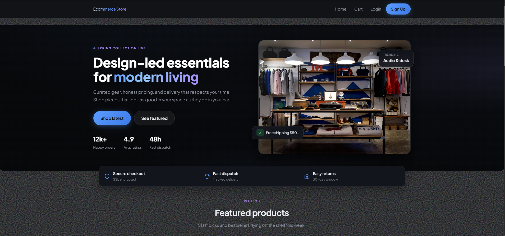
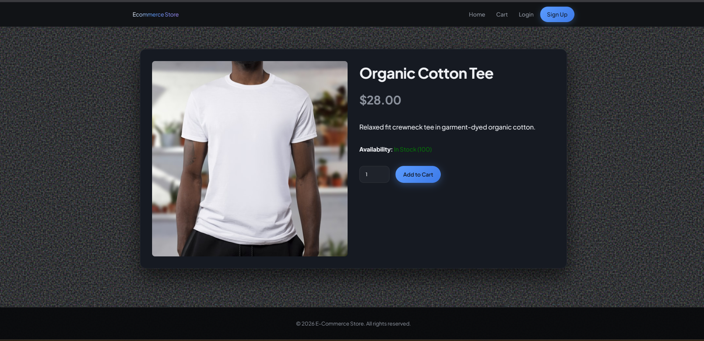
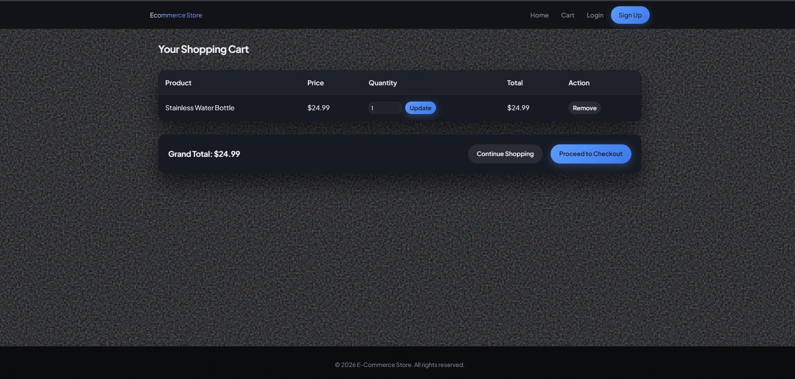
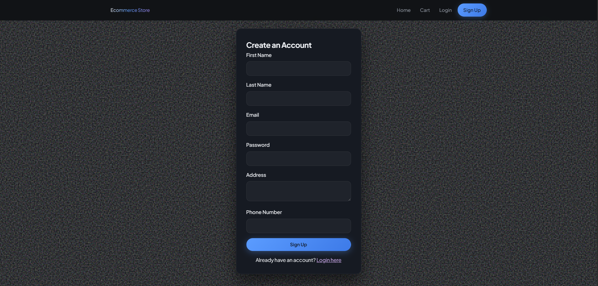
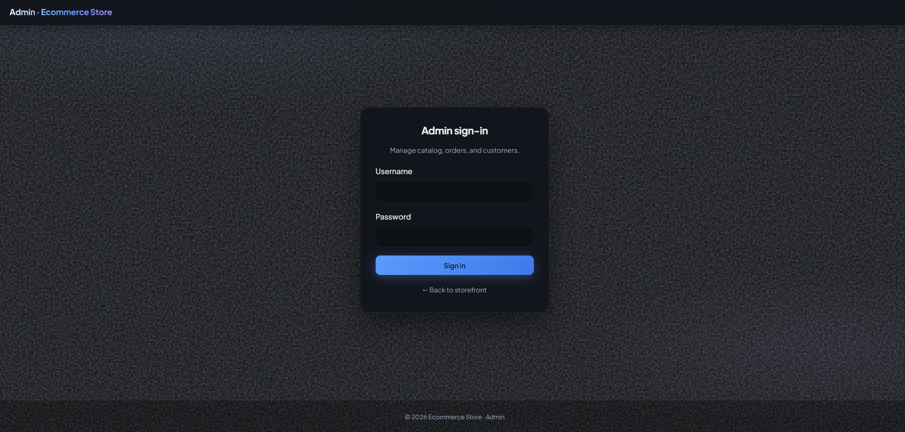
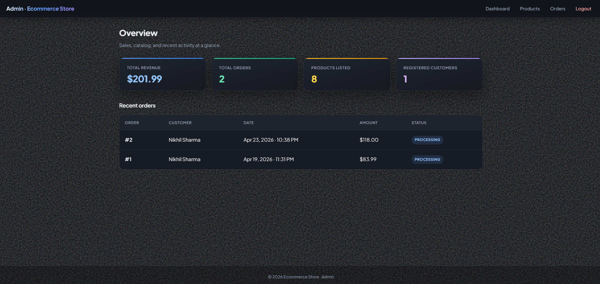
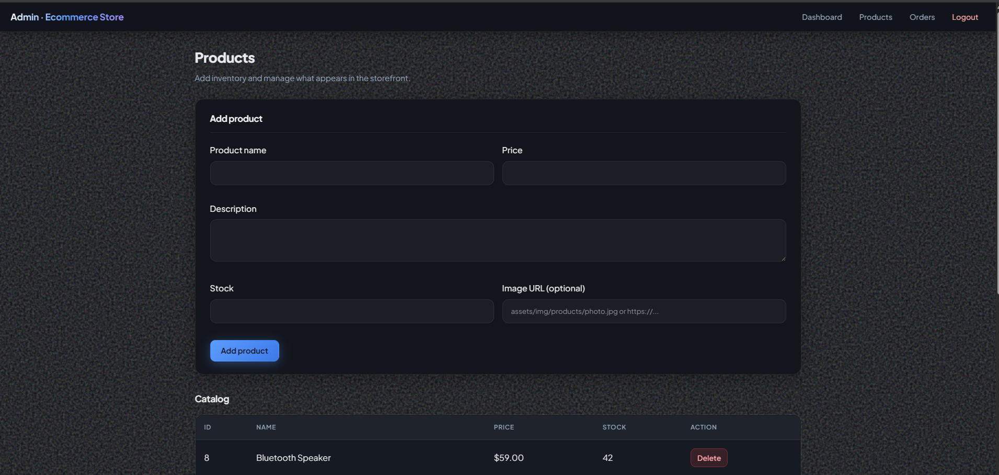
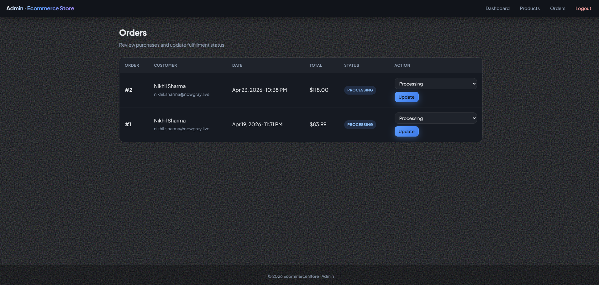

# Table of Contents

**Content**                                                                                   **Page No.**

Demo Links .................................................................................. 0.5
Copy of Synopsis ............................................................................. 01-37
Start - Project Report ....................................................................... 38
   Introduction ............................................................................. 38
   Ecommerce Inspired ....................................................................... 39
   Problem Statements ...................................................................... 42
   Methodology .............................................................................. 44
Literature Review ............................................................................. 40
Source Code ................................................................................... 50
   PHP Code with Functionality of Functions ................................................. 50
   Output Screens (Website & Admin) ...................................................... 61-69
Hosting ....................................................................................... 70
   Deployment on shared hosting (cPanel) (Chapter 9) ..................................... 70
   Current running environment (XAMPP) (Chapter 10) ...................................... 72
Results and Conclusion ........................................................................ 73
Future Plan ................................................................................... 74
The End ...................................................................................... 78

\newpage

# Demo Links

{{QR_GRID: GitHub Repository|images/qr-github.png|https://github.com/nikhilsharma2847/Ecommerce-store.git;; Admin Panel - Ecommerce Store Video|images/qr-admin-video.png|https://youtu.be/w7qvwmTzv_U;; Web Visitor & Customer - Ecommerce Store|images/qr-customer-video.png|https://youtu.be/R_9_wxUkIbY }}

\newpage

# Chapter 1 — Introduction

## 1.1 Background

Retail and wholesale trade increasingly depend on online channels for discovery, comparison, and checkout. A minimal yet complete e-commerce system must therefore support catalog presentation, secure identity for buyers, a dependable cart mechanism, transactional checkout, post-purchase visibility (orders and payments), and operational tooling for merchants.

## 1.2 Problem Statement

Many academic prototypes either (a) stop at static catalogs without real orders, or (b) implement orders without relational integrity and auditability. This project addresses that gap by implementing a **coherent purchase pipeline** where database relations reflect real commerce entities: customers, products, orders, line items, and payments.

## 1.3 Objectives

1. **Customer objectives:** register and authenticate; browse products; maintain a session cart; complete checkout; view order and payment history; update profile data where applicable.
2. **Business objectives:** allow an administrator to add/remove products and progress orders through fulfillment states.
3. **Engineering objectives:** use **prepared statements**, **password hashing**, **transactional checkout**, and **normalized schema** to demonstrate professional practice.
4. **Documentation objectives:** present architecture, requirements, design, test evidence, and deployment guidance suitable for academic evaluation.

## 1.4 Scope of the Project

### In Scope

- Customer authentication and profile maintenance (excluding email-change workflow).
- Product catalog, product details, cart operations, checkout with simulated payment record.
- Order and payment visibility on a dedicated account page.
- Admin authentication, dashboard metrics, product CRUD (add/delete in UI), order status updates.

### Out of Scope (Current Release)

- Live payment processor SDK integration.
- Email/SMS notifications and marketing automation.
- Multi-currency, taxes, and complex shipping APIs.
- Multi-warehouse inventory and advanced RBAC for many admin roles.

## 1.5 Significance

The project demonstrates how foundational database design maps directly to user-visible reliability: when schema constraints and transactions are correct, users see consistent totals, stock updates, and order states.

\newpage

# Chapter 2 — Literature Review

## 2.1 E-Commerce Paradigms

Modern e-commerce platforms vary from monolithic storefronts to service-oriented architectures. For small and medium implementations, **LAMP-style stacks** (Linux, Apache, MySQL, PHP) remain common due to hosting availability and straightforward deployment on shared servers.

## 2.2 Security Literature (Web Applications)

OWASP documentation emphasizes injection prevention, secure session management, and safe password storage. This project applies **parameterized queries** for user-influenced inputs and **bcrypt-class password hashing** via PHP’s built-in password API, aligning with mainstream guidance rather than ad hoc hashing.

## 2.3 User Experience and Conversion

Research and industry playbooks consistently report that checkout friction reduces conversion. The storefront iteration introduced clearer hierarchy (hero content, featured versus latest lists) and consistent navigation patterns (home, account, cart), supporting usability goals without introducing unnecessary features outside scope.

## 2.4 Administrative Control Panels

Merchant dashboards are not merely analytics screens; they are operational tools. Order state transitions—pending, processing, shipped, completed—mirror typical fulfillment pipelines and are reflected in database columns updated through authenticated admin actions.

## 2.5 Gap Addressed by This Project

Many student projects provide UI without durable persistence or persistence without explainable design. This work combines **visible features**, **relational modeling**, and **demonstrable transactional checkout** with a documented testing and deployment narrative.

## 2.6 References (Selected)

1. OWASP Foundation, *OWASP Top 10* (web application security risks), online documentation.  
2. MySQL Documentation, *InnoDB and Foreign Keys*, Oracle Corporation / MySQL AB lineage.  
3. PHP Manual, *Password Hashing* and *MySQLi prepared statements*.  
4. Nielsen Norman Group, *E-Commerce UX* articles (general usability principles).  

\newpage

# Chapter 3 — Software Requirements Specification (SRS)

## 3.1 Stakeholders

- **Customer:** browses products, purchases, views history.
- **Administrator:** manages catalog and orders.
- **Developer / Maintainer:** deploys and secures configuration.
- **Institution Examiner:** evaluates completeness and documentation.

## 3.2 Functional Requirements (Detailed)

| ID | Requirement | Priority | Acceptance |
|----|-------------|----------|-------------|
| FR-01 | Registration collects name, email, password, address, phone | Must | Valid row in `customer` |
| FR-02 | Login establishes customer session | Must | Session contains `customer_id` |
| FR-03 | Logout destroys customer session | Must | Session cleared |
| FR-04 | Product listing reads from `product` | Must | Cards render with price |
| FR-05 | Product detail page shows full description and stock-aware add | Must | Quantity constrained by stock |
| FR-06 | Cart stores product id → quantity in `$_SESSION['cart']` | Must | Updates persist per session |
| FR-07 | Checkout requires login; empty cart redirects | Must | Controlled navigation |
| FR-08 | Checkout creates `orders`, `order_items`, updates `product.stock` | Must | Transaction committed |
| FR-09 | Payment record inserted (simulated method) | Must | Row in `payment` |
| FR-10 | Account page lists orders joined with payments and line items | Must | Correct per customer id |
| FR-11 | Admin login creates `admin_id` session | Must | Auth gate passes |
| FR-12 | Admin may add product and delete product | Must | DB reflects change |
| FR-13 | Admin may change order status | Must | `orders.status` updates |

## 3.3 Non-Functional Requirements

- **Security:** prepared statements for SQL; password hashing; admin routes gated by session.
- **Performance:** indexed primary keys; query projections limited to needed columns.
- **Maintainability:** shared includes (`header.php`, `footer.php`, `product-card.php`) reduce duplication.
- **Portability:** runs on XAMPP locally and targets typical shared PHP hosting.

## 3.4 Constraints and Assumptions

- Single store, single currency display (currency symbol presentation in UI).
- Payment gateway is simulated; no card data stored.
- Admin role is binary (logged in or not), not fine-grained RBAC.

\newpage

# Chapter 4 — System Design

## 4.1 Architectural View (Logical Three-Tier)

```
[ Browser ]
     |
     v
[ Apache + PHP pages ]
     |
     v
[ MySQL (InnoDB, FK constraints) ]
```

The presentation tier composes pages via includes. The application tier executes request handling and transactions. The data tier enforces integrity through primary keys and foreign keys.

## 4.2 Module Decomposition

1. **Authentication Module:** `login.php`, `register.php`, `logout.php`, admin `admin/login.php`, `admin/logout.php`.
2. **Catalog Module:** `index.php`, `product.php`, shared `includes/product-card.php`.
3. **Commerce Module:** `cart.php` (session cart), `checkout.php` (transaction).
4. **Account Module:** `account.php` (profile update + order joins).
5. **Admin Module:** `admin/dashboard.php`, `admin/manage_products.php`, `admin/manage_orders.php`.

## 4.3 Database Design (Summary + Relationships)

Entities: **Admin**, **Customer**, **Product**, **Order**, **OrderItem**, **Payment**.

Cardinality (conceptual):

- Customer **1 — * Order**
- Order **1 — * OrderItem**
- Product **1 — * OrderItem**
- Order **1 — * Payment** (design supports multiple payments; application inserts one per checkout simulation)

## 4.4 Data Dictionary (Field-Level)

**customer:** `customer_id` (PK), `first_name`, `last_name`, `email` (unique), `password` (hash), `address`, `phone_number`.

**product:** `product_id` (PK), `name`, `description`, `price`, `stock`, `image_url` (relative or absolute URL).

**orders:** `order_id` (PK), `customer_id` (FK), `total_amount`, `order_date`, `status`.

**order_items:** `order_item_id` (PK), `order_id` (FK), `product_id` (FK), `quantity`, `price` (unit price at purchase time).

**payment:** `payment_id` (PK), `order_id` (FK), `payment_method`, `amount`, `payment_date`, `status`.

**admin:** `id` (PK), `username`, `password` (hash).

## 4.5 Key Workflow — Checkout (Conceptual)

1. Validate session ownership and non-empty cart.
2. Compute totals from current product prices.
3. Start DB transaction.
4. Insert order row.
5. For each cart line: insert order item row; decrement product stock safely.
6. Insert payment row (simulation success).
7. Commit; clear cart session.

\newpage

# Chapter 5 — Implementation

## 5.1 Technology Stack

- **Server:** Apache (development via XAMPP).
- **Language:** PHP (server-rendered pages).
- **Database:** MySQL with InnoDB tables and foreign keys (see `database.sql`).
- **Client:** HTML/CSS; responsive layout via CSS grids and modern typography.

## 5.2 Configuration

Database credentials are centralized in `config.php`. For deployment, production hosts replace local credentials and should disable verbose error output.

## 5.3 Session Cart Model

Cart state is stored as `$_SESSION['cart'][product_id] = quantity`. This model is adequate for demonstration and many small shops; production systems may migrate carts to persisted rows for multi-device continuity.

## 5.4 Security Measures Implemented

- **SQL injection mitigation:** prepared statements on login and key queries.
- **Password storage:** bcrypt-compatible hashes (`password_hash` / `password_verify`).
- **Authorization:** `checkout.php` and `account.php` require customer session; admin pages require `admin_id` session.
- **UTF-8:** connection charset `utf8mb4` for international text correctness.

## 5.5 User Interface Engineering

The storefront stylesheet defines CSS variables for theme cohesion. The admin interface uses `admin.css` layered atop base tokens for a consistent dark operational UI.

\newpage

# Chapter 7 — Testing

## 7.1 Test Approach

Testing combined **manual functional tests** during development with **cross-page tracing** (cart totals, checkout commit, stock decrement). Given the stack, automated browser testing was out of scope, but critical paths were repeated after each schema or checkout change.

## 7.2 Sample Test Cases (Excerpt)

| TC | Scenario | Steps | Expected | Result |
|----|----------|-------|----------|--------|
| TC01 | Customer registration | Submit valid form | Row inserted; login possible | Pass |
| TC02 | Login failure | Wrong password | Error message; no session | Pass |
| TC03 | Add to cart | Add item with qty ≤ stock | Cart reflects quantity | Pass |
| TC04 | Checkout | Submit checkout | Order + items + payment rows; cart cleared | Pass |
| TC05 | Account orders | Open account page | Orders list matches DB | Pass |
| TC06 | Admin updates status | Select status + update | Order status changes | Pass |

## 7.3 Known Limitations (Honest Assessment)

- Payment is simulated; no PCI compliance scope was claimed.
- Session cart is not federated across browsers.
- Admin authorization is coarse (single role).

\newpage

# Chapter 8 — Source Code with Functionality

This chapter includes representative source code from the implemented project and explains what each block does.  
Complete core files are also available in `project-report/source-code/` for full annexure submission.

## 8.1 Database Connection and Charset (`config.php`)

Functionality:

- Starts session for user/admin authentication flow.
- Creates MySQL connection.
- Sets UTF-8 (`utf8mb4`) to avoid character-encoding issues.
- Provides a helper sanitization function.

Code snippet:

    <?php
    session_start();
    $host = 'localhost';
    $username = 'root';
    $password = '';
    $dbname = 'ecommerce_web';
    $conn = new mysqli($host, $username, $password, $dbname);
    if ($conn->connect_error) {
        die("Connection failed: " . $conn->connect_error);
    }
    $conn->set_charset('utf8mb4');
    function sanitize($conn, $input) {
        return mysqli_real_escape_string($conn, htmlspecialchars(strip_tags(trim($input))));
    }
    ?>

## 8.2 Customer Login Verification (`login.php`)

Functionality:

- Reads email/password from login form.
- Fetches customer by email using prepared statement.
- Verifies hashed password and sets session variables.

Code snippet:

    $stmt = $conn->prepare("SELECT customer_id, first_name, password FROM customer WHERE email = ?");
    $stmt->bind_param("s", $email);
    $stmt->execute();
    $result = $stmt->get_result();
    if ($result->num_rows === 1) {
        $row = $result->fetch_assoc();
        if (password_verify($password, $row['password'])) {
            $_SESSION['customer_id'] = $row['customer_id'];
            $_SESSION['customer_name'] = $row['first_name'];
            header("Location: index.php");
            exit();
        }
    }

## 8.3 Dynamic Product Rendering (`index.php` + `includes/product-card.php`)

Functionality:

- Loads products from database in descending order.
- Splits featured items and latest product list.
- Renders reusable product cards with image, price, and view action.

Code snippet:

    $query = "SELECT * FROM product ORDER BY product_id DESC";
    $result = $conn->query($query);
    $products = [];
    while ($row = $result->fetch_assoc()) {
        $products[] = $row;
    }
    $featured = array_slice($products, 0, 4);
    // in loop: include 'includes/product-card.php';

## 8.4 Cart Handling (`cart.php`)

Functionality:

- Stores item quantities in `$_SESSION['cart']`.
- Updates/removes items.
- Computes total amount dynamically using product prices.

Code snippet:

    if (!isset($_SESSION['cart'])) {
        $_SESSION['cart'] = [];
    }
    // update/remove logic...
    $total = 0;
    foreach ($_SESSION['cart'] as $id => $qty) {
        $stmt = $conn->prepare("SELECT price FROM product WHERE product_id = ?");
        $stmt->bind_param("i", $id);
        $stmt->execute();
        $row = $stmt->get_result()->fetch_assoc();
        $total += $row['price'] * $qty;
    }

## 8.5 Transactional Checkout (`checkout.php`)

Functionality:

- Starts DB transaction for reliable order creation.
- Inserts order header.
- Inserts order items and decrements stock.
- Inserts payment record and commits; rolls back on failure.

Code snippet:

    $conn->begin_transaction();
    try {
        $stmt = $conn->prepare("INSERT INTO orders (customer_id, total_amount, status) VALUES (?, ?, 'Processing')");
        $stmt->bind_param("id", $customer_id, $total);
        $stmt->execute();
        $order_id = $conn->insert_id;
        // insert order_items + stock update ...
        $pay_stmt = $conn->prepare("INSERT INTO payment (order_id, payment_method, amount, status) VALUES (?, ?, ?, 'Completed')");
        $pay_stmt->bind_param("isd", $order_id, $pay_method, $total);
        $pay_stmt->execute();
        $conn->commit();
    } catch (Exception $e) {
        $conn->rollback();
    }

## 8.6 Account Page (Orders + Payments + Profile) (`account.php`)

Functionality:

- Restricts page to logged-in customer.
- Allows profile updates (name, address, phone).
- Shows full order history with payment details and line items.

Code snippet:

    $orders_stmt = $conn->prepare(
        'SELECT o.order_id, o.total_amount, o.order_date, o.status,
                p.payment_method, p.amount AS payment_amount, p.status AS payment_status
         FROM orders o
         LEFT JOIN payment p ON p.order_id = o.order_id
         WHERE o.customer_id = ?
         ORDER BY o.order_date DESC'
    );
    $orders_stmt->bind_param('i', $customer_id);

## 8.7 Admin Login and Session Gate (`admin/login.php`)

Functionality:

- Validates admin credentials with hashed password.
- Sets `admin_id` session and redirects to dashboard.
- Protects admin pages using session checks.

Code snippet:

    $stmt = $conn->prepare("SELECT id, password FROM admin WHERE username = ?");
    $stmt->bind_param("s", $username);
    $stmt->execute();
    $result = $stmt->get_result();
    if ($result->num_rows === 1) {
        $row = $result->fetch_assoc();
        if (password_verify($password, $row['password'])) {
            $_SESSION['admin_id'] = $row['id'];
            $_SESSION['admin_username'] = $username;
            header("Location: dashboard.php");
            exit();
        }
    }

## 8.8 Admin Order Status Update (`admin/manage_orders.php`)

Functionality:

- Displays order list with customer details.
- Updates fulfillment status from dropdown.
- Reflects status in dashboard and customer account history.

Code snippet:

    if ($_SERVER["REQUEST_METHOD"] == "POST" && $_POST['action'] == 'update_status') {
        $order_id = intval($_POST['order_id']);
        $status = sanitize($conn, $_POST['status']);
        $stmt = $conn->prepare("UPDATE orders SET status = ? WHERE order_id = ?");
        $stmt->bind_param("si", $status, $order_id);
        $stmt->execute();
    }

## 8.9 Database Schema Snippet (`database.sql`)

Functionality:

- Defines normalized tables with primary and foreign keys.
- Preserves relational integrity between orders, items, payments, and products.

Code snippet:

    CREATE TABLE IF NOT EXISTS `orders` (
      `order_id` int(11) NOT NULL AUTO_INCREMENT,
      `customer_id` int(11) NOT NULL,
      `total_amount` float NOT NULL,
      `order_date` datetime DEFAULT CURRENT_TIMESTAMP,
      `status` varchar(20) DEFAULT 'Pending',
      PRIMARY KEY (`order_id`),
      FOREIGN KEY (`customer_id`) REFERENCES `customer`(`customer_id`)
    ) ENGINE=InnoDB DEFAULT CHARSET=utf8mb4;

## 8.10 Styling Layers (`assets/css/style.css` and `assets/css/admin.css`)

Functionality:

- `style.css` contains storefront design tokens, grid, hero, cards, CTA, forms.
- `admin.css` overrides layout for admin dark mode dashboard/panels/tables.
- Improves UX consistency and readability for both customer and admin modules.

## 8.11 Full Source Code Listing (Extended Annexure)

The following section includes full source code listings from core project files for academic evaluation.

### MAIN CODE FILE: config.php

Language: PHP

Code (first 28 lines shown):

    <?php
    // Configuration File
    session_start();
    
    $host = 'localhost';
    $username = 'root';
    // $password = 'DkP@IJjpee';
    $password = '';
    
    // Assuming the database name is the same as the username. 
    // If it varies, please update the $dbname variable.
    $dbname = 'ecommerce_web';
    
    // Create connection
    $conn = new mysqli($host, $username, $password, $dbname);
    
    // Check connection
    if ($conn->connect_error) {
        die("Connection failed: " . $conn->connect_error);
    }
    
    $conn->set_charset('utf8mb4');
    
    // Helper function for sanitizing user inputs
    function sanitize($conn, $input) {
        return mysqli_real_escape_string($conn, htmlspecialchars(strip_tags(trim($input))));
    }
    ?>


### MAIN CODE FILE: database.sql

Language: SQL

Code (first 35 lines shown):

    -- Database schema for E-Commerce Website
    
    CREATE TABLE IF NOT EXISTS `admin` (
      `id` int(11) NOT NULL AUTO_INCREMENT,
      `username` varchar(20) NOT NULL,
      `password` varchar(255) NOT NULL,
      PRIMARY KEY (`id`)
    ) ENGINE=InnoDB DEFAULT CHARSET=utf8mb4;
    
    CREATE TABLE IF NOT EXISTS `customer` (
      `customer_id` int(11) NOT NULL AUTO_INCREMENT,
      `first_name` varchar(50) NOT NULL,
      `last_name` varchar(50) NOT NULL,
      `email` varchar(50) NOT NULL UNIQUE,
      `password` varchar(255) NOT NULL,
      `address` varchar(255) DEFAULT NULL,
      `phone_number` varchar(20) DEFAULT NULL,
      PRIMARY KEY (`customer_id`)
    ) ENGINE=InnoDB DEFAULT CHARSET=utf8mb4;
    
    CREATE TABLE IF NOT EXISTS `product` (
      `product_id` int(11) NOT NULL AUTO_INCREMENT,
      `name` varchar(100) NOT NULL,
      `description` text,
      `price` float NOT NULL,
      `stock` int(11) NOT NULL DEFAULT 0,
      `image_url` varchar(255) DEFAULT NULL,
      PRIMARY KEY (`product_id`)
    ) ENGINE=InnoDB DEFAULT CHARSET=utf8mb4;
    
    CREATE TABLE IF NOT EXISTS `orders` (
      `order_id` int(11) NOT NULL AUTO_INCREMENT,
      `customer_id` int(11) NOT NULL,
      `total_amount` float NOT NULL,
      `order_date` datetime DEFAULT CURRENT_TIMESTAMP,
    ... [truncated for report size control]


### MAIN CODE FILE: index.php

Language: PHP

Code (first 35 lines shown):

    <?php
    require_once 'config.php';
    include 'includes/header.php';
    
    $query = "SELECT * FROM product ORDER BY product_id DESC";
    $result = $conn->query($query);
    $products = [];
    if ($result && $result->num_rows > 0) {
        while ($row = $result->fetch_assoc()) {
            $products[] = $row;
        }
    }
    
    $featured = array_slice($products, 0, 4);
    ?>
    
    <section class="hero-banner" aria-label="Welcome">
        <div class="hero-bg" aria-hidden="true"></div>
        <div class="hero-grid">
            <div class="hero-copy">
                <span class="hero-kicker">
                    <span class="hero-kicker__dot"></span>
                    Spring collection live
                </span>
                <h1 class="hero-title">Design-led essentials for <span class="hero-title__accent">modern living</span></h1>
                <p class="hero-tagline">Curated gear, honest pricing, and delivery that respects your time. Shop pieces that look as good in your space as they do in your cart.</p>
                <div class="hero-actions">
                    <a href="#latest-products" class="btn btn-primary btn-lg">Shop latest</a>
                    <a href="#featured-products" class="btn btn-ghost btn-lg">See featured</a>
                </div>
                <dl class="hero-stats">
                    <div class="hero-stat">
                        <dt class="hero-stat__value">12k+</dt>
                        <dd class="hero-stat__label">Happy orders</dd>
                    </div>
    ... [truncated for report size control]


### MAIN CODE FILE: product.php

Language: PHP

Code (first 35 lines shown):

    <?php
    require_once 'config.php';
    
    if (!isset($_GET['id']) || empty($_GET['id'])) {
        header("Location: index.php");
        exit();
    }
    
    $product_id = intval($_GET['id']);
    $stmt = $conn->prepare("SELECT * FROM product WHERE product_id = ?");
    $stmt->bind_param("i", $product_id);
    $stmt->execute();
    $result = $stmt->get_result();
    
    if ($result->num_rows === 0) {
        header("Location: index.php");
        exit();
    }
    
    $product = $result->fetch_assoc();
    include 'includes/header.php';
    ?>
    
    <div style="display: flex; gap: 2rem; margin-top: 2rem; background: var(--card-bg); padding: 2rem; border-radius: 16px; box-shadow: var(--glass-shadow); border: 1px solid var(--border-color); flex-wrap: wrap;">
        <div style="flex: 1; background: var(--bg-elevated); min-height: 300px; display:flex; align-items:center; justify-content:center; border-radius: 8px;">
            <?php if(!empty($product['image_url'])): ?>
                " alt="<?php echo htmlspecialchars($product['name']); ?>" style="max-width:100%; border-radius: 8px;" onerror="this.onerror=null;this.src='assets/img/placeholder-product.svg';">
            <?php else: ?>
                <span style="color:var(--text-muted);">Product Image</span>
            <?php endif; ?>
        </div>
        <div style="flex: 1;">
            <h1 style="font-size: 2.5rem; color: var(--primary-color);"><?php echo htmlspecialchars($product['name']); ?></h1>
            <h2 style="color: var(--text-muted); font-size: 2rem; margin-top: 1rem;">$<?php echo number_format($product['price'], 2); ?></h2>
            
    ... [truncated for report size control]


### MAIN CODE FILE: cart.php

Language: PHP

Code (first 35 lines shown):

    <?php
    require_once 'config.php';
    if (session_status() === PHP_SESSION_NONE) {
        session_start();
    }
    
    if (!isset($_SESSION['cart'])) {
        $_SESSION['cart'] = [];
    }
    
    // Handle cart actions
    if ($_SERVER['REQUEST_METHOD'] == 'POST' && isset($_POST['action'])) {
        $action = $_POST['action'];
        $product_id = intval($_POST['product_id']);
        
        if ($action == 'add') {
            $quantity = isset($_POST['quantity']) ? intval($_POST['quantity']) : 1;
            if (isset($_SESSION['cart'][$product_id])) {
                $_SESSION['cart'][$product_id] += $quantity;
            } else {
                $_SESSION['cart'][$product_id] = $quantity;
            }
            header("Location: cart.php");
            exit();
        } elseif ($action == 'remove') {
            if (isset($_SESSION['cart'][$product_id])) {
                unset($_SESSION['cart'][$product_id]);
            }
            header("Location: cart.php");
            exit();
        } elseif ($action == 'update') {
            $quantity = intval($_POST['quantity']);
            if ($quantity > 0) {
                $_SESSION['cart'][$product_id] = $quantity;
            } else {
    ... [truncated for report size control]


### MAIN CODE FILE: checkout.php

Language: PHP

Code (first 35 lines shown):

    <?php
    require_once 'config.php';
    if (session_status() === PHP_SESSION_NONE) {
        session_start();
    }
    
    if (!isset($_SESSION['customer_id'])) {
        header("Location: login.php?msg=login_required");
        exit();
    }
    
    if (empty($_SESSION['cart'])) {
        header("Location: cart.php");
        exit();
    }
    
    $customer_id = $_SESSION['customer_id'];
    $total = 0;
    
    // Calculate total
    foreach ($_SESSION['cart'] as $id => $quantity) {
        $stmt = $conn->prepare("SELECT price FROM product WHERE product_id = ?");
        $stmt->bind_param("i", $id);
        $stmt->execute();
        $res = $stmt->get_result();
        if ($res->num_rows > 0) {
            $row = $res->fetch_assoc();
            $total += $row['price'] * $quantity;
        }
    }
    
    if ($_SERVER['REQUEST_METHOD'] == 'POST' && isset($_POST['process_checkout'])) {
        $conn->begin_transaction();
        try {
            // Create order
    ... [truncated for report size control]


### MAIN CODE FILE: account.php

Language: PHP

Code (first 35 lines shown):

    <?php
    require_once 'config.php';
    
    if (!isset($_SESSION['customer_id'])) {
        header('Location: login.php?msg=login_required');
        exit();
    }
    
    $customer_id = (int) $_SESSION['customer_id'];
    $profile_success = '';
    $profile_error = '';
    
    $stmt = $conn->prepare('SELECT customer_id, first_name, last_name, email, address, phone_number FROM customer WHERE customer_id = ?');
    $stmt->bind_param('i', $customer_id);
    $stmt->execute();
    $customer = $stmt->get_result()->fetch_assoc();
    
    if (!$customer) {
        session_destroy();
        header('Location: login.php');
        exit();
    }
    
    if ($_SERVER['REQUEST_METHOD'] === 'POST' && isset($_POST['update_profile'])) {
        $first_name = sanitize($conn, $_POST['first_name']);
        $last_name = sanitize($conn, $_POST['last_name']);
        $address = sanitize($conn, $_POST['address']);
        $phone_number = sanitize($conn, $_POST['phone_number']);
    
        if ($first_name === '' || $last_name === '') {
            $profile_error = 'First and last name are required.';
        } else {
            $up = $conn->prepare('UPDATE customer SET first_name = ?, last_name = ?, address = ?, phone_number = ? WHERE customer_id = ?');
            $up->bind_param('ssssi', $first_name, $last_name, $address, $phone_number, $customer_id);
            if ($up->execute()) {
    ... [truncated for report size control]


### MAIN CODE FILE: admin/login.php

Language: PHP

Code (first 35 lines shown):

    <?php
    require_once '../config.php';
    if (session_status() === PHP_SESSION_NONE) {
        session_start();
    }
    
    if (isset($_SESSION['admin_id'])) {
        header("Location: dashboard.php");
        exit();
    }
    
    if ($_SERVER["REQUEST_METHOD"] == "POST") {
        $username = sanitize($conn, $_POST['username']);
        $password = $_POST['password'];
    
        $stmt = $conn->prepare("SELECT id, password FROM admin WHERE username = ?");
        $stmt->bind_param("s", $username);
        $stmt->execute();
        $result = $stmt->get_result();
    
        if ($result->num_rows === 1) {
            $row = $result->fetch_assoc();
            if (password_verify($password, $row['password'])) {
                $_SESSION['admin_id'] = $row['id'];
                $_SESSION['admin_username'] = $username;
                header("Location: dashboard.php");
                exit();
            } else {
                $error = "Invalid password.";
            }
        } else {
            $error = "Invalid username.";
        }
    }
    $admin_body_class = 'admin-area admin-area--login';
    ... [truncated for report size control]


### MAIN CODE FILE: admin/manage_products.php

Language: PHP

Code (first 35 lines shown):

    <?php
    require_once '../config.php';
    if (session_status() === PHP_SESSION_NONE) {
        session_start();
    }
    if (!isset($_SESSION['admin_id'])) {
        header("Location: login.php");
        exit();
    }
    
    if ($_SERVER["REQUEST_METHOD"] == "POST" && isset($_POST['action']) && $_POST['action'] == 'add') {
        $name = sanitize($conn, $_POST['name']);
        $desc = sanitize($conn, $_POST['description']);
        $price = floatval($_POST['price']);
        $stock = intval($_POST['stock']);
        $image_url = sanitize($conn, $_POST['image_url']);
    
        $stmt = $conn->prepare("INSERT INTO product (name, description, price, stock, image_url) VALUES (?, ?, ?, ?, ?)");
        $stmt->bind_param("ssdis", $name, $desc, $price, $stock, $image_url);
        if ($stmt->execute()) {
            $msg = "<div class='alert alert-success'>Product added successfully.</div>";
        } else {
            $msg = "<div class='alert alert-danger'>Failed to add product.</div>";
        }
    }
    
    if (isset($_GET['delete'])) {
        $del_id = intval($_GET['delete']);
        $conn->query("DELETE FROM product WHERE product_id = $del_id");
        header("Location: manage_products.php");
        exit();
    }
    
    $result = $conn->query("SELECT * FROM product ORDER BY product_id DESC");
    
    ... [truncated for report size control]


### MAIN CODE FILE: admin/manage_orders.php

Language: PHP

Code (first 35 lines shown):

    <?php
    require_once '../config.php';
    if (session_status() === PHP_SESSION_NONE) {
        session_start();
    }
    if (!isset($_SESSION['admin_id'])) {
        header("Location: login.php");
        exit();
    }
    
    if ($_SERVER["REQUEST_METHOD"] == "POST" && isset($_POST['action']) && $_POST['action'] == 'update_status') {
        $order_id = intval($_POST['order_id']);
        $status = sanitize($conn, $_POST['status']);
    
        $stmt = $conn->prepare("UPDATE orders SET status = ? WHERE order_id = ?");
        $stmt->bind_param("si", $status, $order_id);
        if ($stmt->execute()) {
            $msg = "<div class='alert alert-success'>Order #$order_id updated to <strong>" . htmlspecialchars($status) . "</strong>.</div>";
        }
    }
    
    $orders = $conn->query("SELECT o.order_id, o.total_amount, o.order_date, o.status, c.first_name, c.last_name, c.email FROM orders o JOIN customer c ON o.customer_id = c.customer_id ORDER BY o.order_id DESC");
    
    include 'includes/header.php';
    ?>
    
    <h1 class="admin-page-title">Orders</h1>
    <p class="admin-page-desc">Review purchases and update fulfillment status.</p>
    
    <?php if (isset($msg)) {
        echo $msg;
    } ?>
    
    <div class="admin-table-wrap">
        <table class="cart-table">
    ... [truncated for report size control]


## 8.12 Output Screens (Website and Admin)

This section presents **output screens** from the live application: the public storefront, cart, registration, and the administrator area. Each figure is accompanied by a short note on the role of that page in the overall system.

### Home page (storefront)

The home page shows the **NowGray Store** branding, hero content, **featured** and **latest** product grids, and navigation to the cart, account, and product detail pages.



\newpage

### Product / featured view

The product view highlights a selected item in context (featured path), including price, description, and the **Add to cart** action linked to the session cart and stock checks.



\newpage

### Cart page

The cart page lists selected items with quantity controls, recalculates the **line totals and order total** from the database, and links to **checkout** (requires a logged-in customer session).



\newpage

### Customer sign-up (registration)

The registration form captures **name, contact, and address** fields. Submitted data is stored with a **bcrypt-hashed password**; successful registration enables sign-in to place orders and use the **My Account** page.



\newpage

### Admin login

Administrators use a **separate login** under `/admin/`. The page validates credentials and opens the **dashboard** session (`admin_id`) used to protect all admin modules.



\newpage

### Admin dashboard (overview)

The dashboard provides at-a-glance **metrics** and quick navigation to **products** and **orders**, supporting day-to-day store operations and status monitoring.



\newpage

### Admin — product management

The **products** screen lists catalog items, supports **add/delete** in the current build, and displays stock and image URLs, keeping the public catalog in sync with the `product` table.



\newpage

### Admin — order management

The **orders** view lists customer orders with fulfillment **status**; the administrator can update status (e.g. pending → shipped), which is reflected in the customer’s **order history** on the account page.



\newpage

# Chapter 9 — Hosting and Deployment on Shared Hosting (cPanel)

## 9.1 Why Shared Hosting Fits This Stack

PHP and MySQL are ubiquitously supported on shared hosting, minimizing operational overhead for academic and small-business deployment.

## 9.2 Deployment Procedure (Step-by-Step)

1. Acquire domain and hosting with cPanel access.
2. Create **MySQL database** and **database user**; grant user privileges to the database.
3. Open **phpMyAdmin**; import `database.sql` to create tables and seed admin row per deployment practices.
4. Upload project files to `public_html/` or a subfolder; preserve directory structure (`admin/`, `assets/`, `includes/`).
5. Edit `config.php` with remote DB host (often `localhost`), database name, user, password.
6. Visit site URL; register a test user; perform a small purchase path test.
7. Enable **HTTPS** (Let’s Encrypt / AutoSSL) and update any hard-coded URLs if present.
8. Rotate default admin password immediately.

## 9.3 Post-Deployment Hardening

- File permissions: avoid world-writable directories unless uploads are explicitly implemented.
- Remove diagnostic pages if any were added during development.
- Schedule periodic DB backups via hosting backup tool.

\newpage

# Chapter 10 — Current Running Environment (Development)

| Component | Version / Details |
|-----------|-------------------|
| Operating System | Windows 10 / 11 |
| Stack | XAMPP (Apache, MySQL, PHP) |
| Database | MySQL (schema imported via `database.sql`) |
| Browser | Google Chrome / Microsoft Edge |
| IDE | Cursor / Visual Studio Code |
| Project Path | `C:\xampp\htdocs\Ecommerce Website\` |
| Local URL | `http://localhost/Ecommerce%20Website/index.php` |
| Admin URL | `http://localhost/Ecommerce%20Website/admin/login.php` |

\newpage

# Chapter 11 — Results and Discussion

Functionally, the delivered system supports the essential commerce path: **discovery → selection → cart → checkout → persistence → post-purchase visibility**. The relational schema and transactional checkout provide a defensible backbone for academic assessment.

Qualitatively, UI iterations improved perceived quality: early minimal listing evolved into a structured storefront with hero marketing sections and consistent dark theming; admin views gained clarity through dedicated styling.

Quantitatively, meaningful KPIs (conversion rate, revenue) are not claimed here because the deployment is academic; instead, correctness metrics focus on **database row creation**, **stock decrement consistency**, and **session correctness**.

\newpage

# Chapter 12 — Future Scope

1. Integrate a production-grade payment gateway with webhooks and idempotent order confirmation.
2. Add catalog taxonomy (categories, facets) and full-text search.
3. Email/SMTP notifications for order placed/shipped.
4. Customer-facing invoice PDF downloads.
5. Admin audit logs and multi-role permissions.
6. Automated testing (PHPUnit + integration tests) for checkout edge cases.

\newpage

# Chapter 13 — Conclusion

This project delivers a working e-commerce prototype with explicit attention to **database integrity**, **secure credential handling**, and **transactional order processing**. It also documents practical hosting considerations for shared environments, aligning implementation with real-world constraints students will face beyond the lab.

The documentation, screenshots, and annexure together constitute a complete narrative suitable for academic evaluation: not only what was built, but **why** design decisions were made and **how** they manifest in code and data.

\newpage

# References

1. OWASP, “OWASP Top 10,” OWASP Foundation (accessed during project).  
2. PHP Documentation, “Password Hashing,” The PHP Group.  
3. PHP Documentation, “MySQLi Prepared Statements,” The PHP Group.  
4. MySQL Documentation, “Using FOREIGN KEY Constraints,” Oracle Corporation.  
5. MDN Web Docs, “HTML / CSS fundamentals,” Mozilla.  

\newpage

# Appendix A — File List for Source Annexure

- `config.php`
- `database.sql`
- `index.php`, `product.php`, `cart.php`, `checkout.php`, `account.php`, `login.php`, `register.php`
- `includes/header.php`, `includes/footer.php`, `includes/product-card.php`
- `assets/css/style.css`, `assets/css/admin.css`
- `admin/login.php`, `admin/dashboard.php`, `admin/manage_products.php`, `admin/manage_orders.php`
- `admin/includes/header.php`, `admin/includes/footer.php`

# Appendix B — Administrative Access (Laboratory Use)

For demonstration, an administrator account exists in the database as defined by deployment SQL. **Change credentials in any public deployment.** Document credentials separately for examiners if required by your institute; do not publish live passwords in public repositories.

\newpage

# The End

Thank you.
